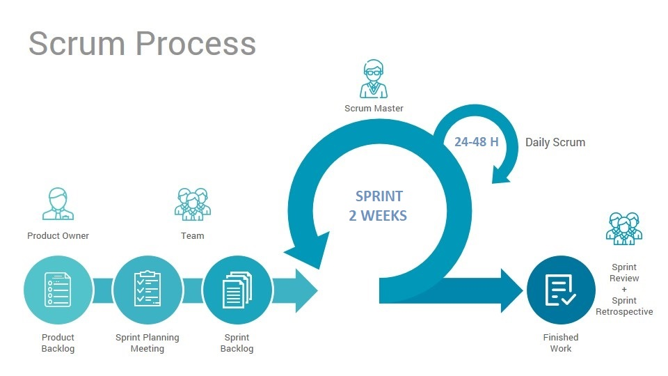

<h1 align="center"> <b>Report progetto Scacchi</b> </h1>

<h2> <b>Indice</b> </h2>

1. Introduzione
2. Modello di dominio
3. Requisiti specifici
    - Requisiti funzionali
    - Requisiti non funzionali
4. System Design
    - Stile architetturale adottato
    - Diagramma dei package, diagramma dei componenti
    - Commentare le decisioni prese
5. OO Design
    - Diagrammi delle classi e diagrammi di sequenza   
    - Menzionare l'eventuale applicazione di design pattern
    - Commentare le decisioni prese
6. Riepilogo del test
    - Riportare la tabella riassuntiva di coveralls (o jacoco), con dati sul numero dei casi di test e copertura del codice
7. Manuale utente
8. Processo di sviluppo e organizzazione del lavoro
9. Analisi retrospettiva

# 

<br>

<h2> <b>1. Introduzione </b> </h2>
<hr>
Con la presente relazione si intende evidenziare la realizzazione di un software che permetta la simulazione del gioco degli scacchi con interfaccia a linea di comando (CLI), accettando mosse in notazione algebrica abbreviata in lingua italiana. 
Gli scacchi sono un gioco di strategia che si svolge su una tavola quadrata detta scacchiera, formata da 64 caselle (o "case") di due colori alternati, sulla quale ogni giocatore dispone di 16 pezzi (bianchi o neri): un re, una donna (o "regina"), due alfieri, due cavalli, due torri e otto pedoni.
<br>Il progetto è stato portato avanti in team, seguendo i principi del Manifesto dello Sviluppo Agile e dell'Object Oriented Design.

<br><br>

<h2> <b>2. Modello di dominio </b> </h2>
<hr>
Il modello di dominio è utile a comprendere i concetti fondamentali di un ambito ed è indipendente dal software. Al fine di modellarlo, si utilizza un diagramma delle classi con prospettiva concettuale. <br>Il modello di dominio, da noi preso in esame, è il gioco degli scacchi:


<div align="center">


</div>

<h6>Sulla scacchiera vengono posizionate 32 pedine, le quali possono assumere due diversi colori: bianco o nero. Ad ogni pedina è associato un ruolo, ovvero: Re, Donna, Alfiere, Torre, Cavallo e Pedone.
I due utenti possono muovere le pedine interagendo con la scacchiera, alternandosi in base al turno.</h6>

<br><br>

<h2> <b>3. Requisiti specifici </b> </h2>  
<hr>
Un requisito è una caratteristica o condizione che il sistema è tenuto a rispettare in modo da soddisfare i bisogni del/i committente/i. Essi si distinguono in requisiti funzionali e non funzionali. Quelli funzionali rappresentano una feature che il sistema offre ai suoi utilizzatori.
Quelli non funzionali, invece, descrivono gli aspetti dell'applicazione che non sono direttamente legati al comportamento (funzionalità) della stessa.

### Requisiti funzionali

- Mostrare elenco comandi: il sistema deve poter mostrare l'elenco di tutti i comandi che l'utente può effettuare. Per farlo l'utente dovrà eseguire il comando <code>help</code>. In output verrà poi visualizzato l'elenco comandi disponibili come da esempio successivo:

```
NewGame
Board
Quit
```

- Iniziare una nuova partita: il sistema deve poter iniziare una nuova partita e a partita iniziata deve essere pronto a ricevere la prima mossa. Inoltre deve essere in grado di ricevere altri comandi. Per farlo l'utente dovrà eseguire il comando <code>play</code> ed eventualmente altri comandi, come da esempio successivo:

```
Inserire cosa si vuole fare, le opzioni sono:
        -play
        -help
        -quit
play
(B) Inserire la mossa/opzione:

```

- Chiudere il gioco: il sistema deve poter chiudere il gioco, previa conferma dell'utente. Per farlo l'utente dovrà eseguire il comando <code>quit</code> e poi dare la conferma, come da esempio successivo:

```
quit
Confermare di voler uscire: Si/No
Si
GRAZIE DI AVER USATO SCACCHI
```
```
quit
Confermare di voler uscire: Si/No
No
Gioco ripreso
```

- Ricominciare la partita: nel mezzo di una partita eseguendo il comando <code>play</code>, il sistema permette di ricominciarla, previa conferma dell'utente.

```
play
Confermare di voler ricominciare la partita: Si/No
si
Il gioco e' ricominciato, inserire prima mossa della partita:
```
```
play
Confermare di voler ricominciare la partita: Si/No
no
Gioco ripreso
```

- Mostrare la scacchiera: eseguendo il comando <code>board</code>, il sistema permette di visualizzare la scacchiera.
<div align="center">


</div>

- Mostrare le mosse giocate: eseguendo il comando <code>moves</code>, il sistema permette di visualizzare lo storico delle mosse giocate.

```
moves
1. a4 b6
2. a5 c6
3. axb6e.p. Ab7
```

- Visualizzare le catture: eseguendo il comando <code>captures</code>, il sistema permette di mostrare lo storico delle catture effettuate.

```
captures

IL BIANCO HA CATTURATO
        -PEDONE:1
        -TORRE:0
        -CAVALLO:0
        -ALFIERE:0
        -DONNA:0
        -RE:0
IL NERO HA CATTURATO
        -PEDONE:0
        -TORRE:0
        -CAVALLO:0
        -ALFIERE:0
        -DONNA:0
        -RE:0
```

- Muovere il re e catturare con esso: eseguendo la rispettiva mossa in notazione algebrica abbreviata, il sistema permette di muovere il re oppure di catturare un'altra pedina, purchè vengano rispettate le regole degli scacchi. Se si tenta una mossa non valida il sistema deve mostrare il messaggio "mossa non valida" e rimanere in attesa di una mossa valida.

```
Movimento: Rd2
Cattura: Rxc5
```

- Muovere la donna e catturare con essa: eseguendo la rispettiva mossa in notazione algebrica abbreviata, il sistema permette di muovere la donna oppure di catturare un'altra pedina, purchè vengano rispettate le regole degli scacchi. Se si tenta una mossa non valida il sistema deve mostrare il messaggio "mossa non valida" e rimanere in attesa di una mossa valida.

```
Movimento: Db6
Cattura: Dxe4
```

- Muovere la torre e catturare con essa: eseguendo la rispettiva mossa in notazione algebrica abbreviata, il sistema permette di muovere la torre oppure di catturare un'altra pedina, purchè vengano rispettate le regole degli scacchi. Se si tenta una mossa non valida il sistema deve mostrare il messaggio "mossa non valida" e rimanere in attesa di una mossa valida.

```
Movimento: Ta5
Cattura: Txc4
Movimento con ambiguità: Taa5
Cattura con ambiguità: Thxh4
```

- Muovere l'alfiere e catturare con esso: eseguendo la rispettiva mossa in notazione algebrica abbreviata, il sistema permette di muovere l'alfiere oppure di catturare un'altra pedina, purchè vengano rispettate le regole degli scacchi. Se si tenta una mossa non valida il sistema deve mostrare il messaggio "mossa non valida" e rimanere in attesa di una mossa valida.

```
Movimento: Aa3
Cattura: Axf4
```

- Muovere il cavallo e catturare con esso: eseguendo la rispettiva mossa in notazione algebrica abbreviata, il sistema permette di muovere il cavallo oppure di catturare un'altra pedina, purchè vengano rispettate le regole degli scacchi. Se si tenta una mossa non valida il sistema deve mostrare il messaggio "mossa non valida" e rimanere in attesa di una mossa valida.

```
Movimento: Cc3
Cattura: Cxb5
Movimento con ambiguità: C8c7
Cattura con ambiguità: C8xc7
```

- Muovere il pedone e catturare con esso: eseguendo la rispettiva mossa in notazione algebrica abbreviata, il sistema permette di muovere il pedone oppure di catturare un'altra pedina, purchè vengano rispettate le regole degli scacchi. Se si tenta una mossa non valida il sistema deve mostrare il messaggio "mossa non valida" e rimanere in attesa di una mossa valida.

```
Movimento: a3
Cattura: axb6
Cattura en-passant: axb6 e.p.
```

- Effettuare l'arrocco corto: eseguendo la rispettiva mossa in notazione algebrica abbreviata, il sistema permette di effettuare l'arrocco corto, purchè vengano rispettate le regole degli scacchi. Se si tenta una mossa non valida il sistema deve mostrare il messaggio "mossa non valida" e rimanere in attesa di una mossa valida.

```
0-0 oppure o-o oppure O-O
```

- Effettuare l'arrocco lungo: eseguendo la rispettiva mossa in notazione algebrica abbreviata, il sistema permette di effettuare l'arrocco lungo, purchè vengano rispettate le regole degli scacchi. Se si tenta una mossa non valida il sistema deve mostrare il messaggio "mossa non valida" e rimanere in attesa di una mossa valida.

```
0-0-0 oppure o-o-o oppure O-O-O
```

### Requisiti non funzionali

- Il sistema deve rispondere ad ogni comando dell'utente e in caso di comando non riconosciuto, mostrare un messaggio di errore e chiedere di reinserirlo.
- Il sistema deve poter essere eseguito indipendentemente dal dispositivo su cui opera.
- Il sistema è user-friendly, garantendo facilità d'uso per l'utente.

<br>

<h2> <b>4. System Design </b> </h2>
<hr>

Lo stile architetturale adottato per questo progetto è il Model - View - Controller, in quanto permette di separare la logica di presentazione dei dati (Command) dalla logica di business (Board).

<div align="center"> <h3><b>Model View Controller</b></h3>


</div>
<h6> [Board] rappresenta il modello di dominio dell'applicazione e i metodi d'accesso alle informazioni della scacchiera.<br>[Command] rappresenta visualmente le informazioni della scacchiera.<br>[Play] gestisce l'interazione con l'utente, accettando l'input e modificandoli in comandi per i sottosistemi precedentemente descritti. </h6>
<br><br>

<h2> <b>5. OO Design </b> </h2>
<hr>

L'Object Oriented Design è un approccio alla progettazione di sistemi software fondato sul paradigma a oggetti. Questa tipologia di approccio prevede l'utilizzo dei principi di:

- Information hiding
- Basso accoppiamento
- Alta coesione
- Presentazione separata
- Do Not Repeat Yourself
- Principi S.O.L.I.D.

Per quanto concerne questo progetto i suddetti principi sono stati applicati.
L'information hiding è garantito per tutte le classi, adottando la visibilità pubblica e privata, rispettivamente, per metodi e attributi. Per accedere a ciascun attributo è possibile utilizzare metodi di get e set.
L'applicazione dello stesso, risolve i problemi dell'alto accoppiamento, garantendo che eventuali modifiche apportate ad un componente non si propaghino ad altri componenti.
Il grado di dipendenza tra elementi all'interno delle classi è dettato dall'alta coesione, pertanto le classi hanno responsabilità tutte diverse tra loro.
Logica di presentazione e logica di dominio sono tenute separate, consentendo l'indipendenza tra le due parti.
Le funzionalità vengono rappresentate, ciascuna, mediante la creazione di astrazioni appropriate, permettendo di evitare il code reuse in punti diversi dello stesso.
Ad ogni classe è associata una responsabilità come spiegato dal principio di Single Responsibility, appartenente ai principi S.O.L.I.D. Di questi vengono anche rispettati l'Open/Closed, che consente l'estendibilità delle classi, e la Liskov Substitution, garantita dall'uso corretto della generalizzazione.

<div align="center"> <h3><b>Class Diagram</b></h3> 


<hr>


</div>

<br> <br>
<div align="center"> <h3><b>Sequence Diagram: Muovere un alfiere </b></h3>


</div>

<br> <br>
<div align="center"> <h3><b>Sequence Diagram: Iniziare una nuova partita </b></h3>


</div>

<br> <br>
<div align="center"> <h3><b>Sequence Diagram: Arrocco </b></h3>


</div>


<br> <br>

<h2> <b>6. Riepilogo dei test </b> </h2>
<hr>

<div align="center"> <h3><b>Riepilogo Coveralls</b></h3>


<a href="https://coveralls.io/github/softeng1920-inf-uniba/progetto1920-feigenbaum?branch=master">Coveralls Coverage</a>
</div>

<br> <br>
<div align="center"> <h3><b>Riepilogo coverage dei casi di test in Jacoco</b></h3>


</div>
<br>


Nell'effettuare i vari casi di test, le classi **_AppMain_** e **_Play_** non sono state sottoposte a test perchè di tipo Boundary.
La classe Board non risulta coperta al 100% poichè nei casi di test per il metodo **_storeCaptures_**,  ci siamo accorti della mancanza di un caso di default, con relativo break, all'interno di uno switch del suddetto metodo. Questa mancanza provocava un errore di checkstyle e spotbugs e abbiamo preferito eliminare l'errore riducendo, però, la percentuale di coverage al 99%, data l'impossibilità di testare quel caso di default.
<br>Infine, anche la classe **_Command_**, non ha raggiunto la piena percentuale di coverage, causa i metodi **_play_** e **_quit_**, poichè in entrambi durante lo svolgimento dei test abbiamo utilizzato stream di input da tastiera. Entrambi i metodi risultano comunque coperti, rispettivamente all'80% e al 78%, influendo poco nel coverage generale della classe.

<h2> <b>7. Manuale Utente </b> </h2>
<hr>
I requisiti di sistema per questa applicazione sono l'installazione di Docker e un terminale che permetta di visualizzare i caratteri Unicode (UTF-8). I comandi da eseguire da terminale sono:

```
docker pull docker.pkg.github.com/softeng1920-inf-uniba/docker_1920/feigenbaum:latest

docker run -it --rm docker.pkg.github.com/softeng1920-inf-uniba/docker_1920/feigenbaum:latest
```

In fase di avvio dell'applicazione, l’utente decide quale azione effettuare tra quelle disponibili. L’interazione con il programma è garantita attraverso i comandi: help, per conoscere la lista dei comandi accettati, quit per terminare la partita e chiudere il programma, play per iniziare una nuova partita. 
A partita avviata, l’utente può giocare a scacchi, inserendo mosse da riga di comando in notazione algebrica italiana e rispettandone le regole standard. 

Durante la partita è possibile: digitare il comando board per visualizzare la scacchiera, digitare il comando play per ricominciare la partita, digitare il comando captures per visualizzare le pedine catturate da entrambi i giocatori, digitare il comando moves per visualizzare lo storico delle mosse giocate. 
<h6>(N.B.: L'applicazione non permette di effettuare mosse per la chiusura del gioco come: il Re sotto scacco, la promozione di un Pedone, chiedere e accettare la patta).</h6>   
<br><br>
<h2> <b>8. Processo di sviluppo e organizzazione del lavoro </b> </h2>
<hr>
Il software è stato sviluppato seguendo il Manifesto dello sviluppo Agile. Il rispettivo framework utilizzato è Scrum utile a gestire il ciclo di sviluppo del software in maniera iterativa ed incrementale. 

<div align="center"> <h3><b>Scrum Process</b></h3>



</div>

Gli Sprint Planning previsti da Scrum sono alla base della nostra organizzazione del lavoro. La prima parte di ogni riunione è stata svolta con il Product Owner, per definire la lista degli obiettivi richiesti e dei requisiti da rispettare, la seconda con tutti i membri del team. 
Ad ogni compito da svolgere è stata assegnata una stima di difficoltà, in modo da dividere il lavoro equamente. Per i task più impegnativi è stata adottata la tecnica del Pair Programming. 

<div align="center"> <h3><b>Tabella Stime</b></h3>


</div> 

Per rimanere in contatto è stato creato un gruppo sulla piattaforma Teams di Microsoft e per confrontarci su dubbi, problemi riscontrati e progressi effettuati sono stati organizzati Daily Scrum Meeting. 
Per quanto riguarda le Pull Request di GitHub è stata adottata la politica “del 50%”, ovvero nel caso in cui la maggioranza dei membri del team avesse revisionato le modifiche, sarebbe stato possibile chiuderla, al fine di proseguire con il merge. 
Prima di confermare il completamento di ogni Sprint è stata organizzata una Sprint Retrospective per controllare il lavoro svolto e consegnarlo. 
<br><br>
<h2> <b>9. Analisi retrospettiva </b> </h2>
<hr>

🥰 Il team working e la condivisione di un obiettivo comune è stato l'aspetto che più ci ha reso soddisfatti. Imparare a confrontarsi condividendo le stesse responsabilità ha permesso a tutti di poterci immedesimare in dinamiche lavorative delle quali faremo parte. Utilizzare strumenti di sviluppo software all'avanguardia come GitHub e Docker è stato, a primo impatto, complicato data la nostra poca esperienza nel campo. Prendendo dimestichezza con essi, ci siamo resi conto delle loro reali potenzialità e utilità.
Inoltre abbiamo compreso quanto sia importante la fase di testing di un software, prima inconsapevolmente considerata superficiale.

😒 Ci ha reso insoddisfatti, invece, il non aver potuto approfondire alcuni argomenti interessanti dello sviluppo software, come la creazione di script Gradle e l'impostazione di GitHub Actions. 

🤯 Ci ha fatto impazzire il dover cambiare continuamente la visibilità del programma, dovendo applicare molteplici patch. La scelta dello stile della scacchiera e, in particolare, l'uso dei caratteri Unicode è stato complicato. Avremmo preferito giocare a dama, dopo aver scoperto le innumerevoli regole degli scacchi e le espressioni della notazione algebrica.
<br><br>
🃏 Durante i vari meeting a supportarci abbiamo avuto una mascotte speciale, la nostra Lamantina!
<div align="center">


</div> 
